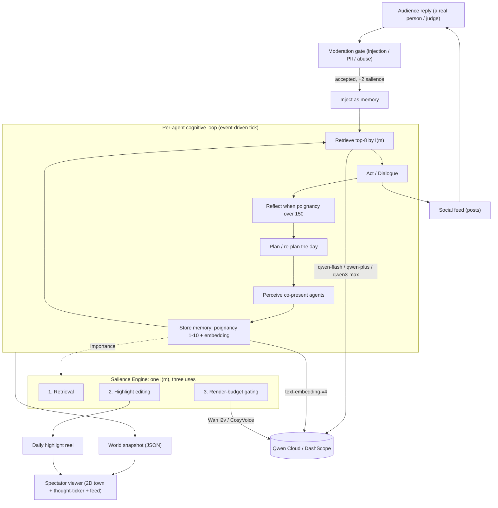

# The Feed — Audience-Coupled Generative Agents

> Stanford built a town of AI minds you could only watch as a replay. We turned it into a
> livestream you can talk to — and every message you send becomes a memory that rewires who
> these characters become.

A live, watchable world of generative agents (memories, tasks, relationships, social media), built
on the architecture of Park et al., *Generative Agents: Interactive Simulacra of Human Behavior*
(Stanford, UIST 2023 · [arXiv:2304.03442](https://arxiv.org/abs/2304.03442)). Entry for the
**Global AI Hackathon Series with Qwen Cloud** — **Agent Society** track.

**The one nameable idea — Audience-Coupled Salience Memory.** A single importance function `I(m)`
scores every event on one scale and drives three subsystems at once: memory **retrieval**, daily
**highlight editing**, and video **render-budget gating**. Real human replies enter the *same* memory
economy (with a +2 salience bias) and causally rewrite what characters do next — the open, perturbable
difference from Stanford's closed sandbox.

## Architecture



Everything above runs today against a deterministic **MockAdapter** so the whole loop is exercisable
offline; the arrows into Qwen Cloud light up by switching one env var (see below). Full component and
deployment detail: [`docs/ARCHITECTURE.md`](./docs/ARCHITECTURE.md).

## How it maps to the judging rubric

| Criterion | Weight | What serves it |
|---|---|---|
| **Innovation & AI Creativity** | 30% | Audience-Coupled Salience Memory — one `I(m)` driving retrieval, highlight editing, and render gating; real human replies rewire agents (`Agent.ingestAudienceReply` + `surfacePendingInjection`). A nameable algorithm, not a prompt wrapper. |
| **Technical Depth & Engineering** | 30% | Faithful memory stream / `I(m)` retrieval / reflection tree / recursive planning; event-driven multi-agent tick loop; fast-forward buffer + NDJSON persistence; a deterministic offline harness with **91 tests + 11 runnable sims**, all green. |
| **Problem Value & Impact** | 25% | A *perturbable* social-simulation testbed — information diffusion, social contagion, and how human feedback steers an agent society — with zero human-subjects risk. Entertainment / game NPCs / synthetic user research as reach. |
| **Presentation & Documentation** | 15% | The spectator viewer + thought-ticker, this README + architecture diagram + reproducible ablation numbers, and the 3-minute demo script in [`strategy/truman-show/`](./strategy/truman-show/). |

## Measured results (the ablation — the track's "measurable multi-agent gain")

Same deterministic world, run under three configs (`npm run sim:ablation`):

| Metric | Full society | Dialogue-ablated |
|---|---|---|
| Rumor diffusion | **4/4 agents** | **1/4** |
| Relationship-graph density | **50%** | **0%** |

**Audience-causal divergence:** injecting one moderated reply changed **25%** of the society's next
actions, versus **0%** in the deterministic no-audience control — a metric a closed sandbox structurally
cannot report. These numbers are re-derived by the test suite, so the README can't drift from the code.

## Quickstart

```bash
# no install needed with Node 22+ and npx (uses tsx)
npm run sim:day2        # day-2 go/no-go: one agent's full perceive→store→retrieve→act loop
npm run sim:town        # multi-agent event-driven tick loop + reflection
npm run sim:gossip      # information diffusion through dialogue
npm run sim:audience    # the money shot: a reply → moderation → memory → visible reaction
npm run sim:ablation    # the measured multi-agent + audience-causal claim
npm run sim:planning    # daily plans + reactive re-planning
npm run sim:buffer      # fast-forward buffer + NDJSON persistence / replay
npm run sim:snapshot    # frontend world-snapshot JSON  (→ data/snapshot.json)
npm run sim:viewer      # render the spectator UI       (→ web/viewer.html, open it)
npm run sim:highlights  # importance-driven daily recap
npm run sim:life        # the integrated living town: plans + conversations in one World tick

npm test                # 91 unit + integration tests
```

## See it running

**Watch the live town: <http://47.237.78.57>** — real Qwen agents on Alibaba Cloud ECS, 24/7. Click a
character to follow their thoughts and reply to them; your message becomes a memory that can change
what they do next.

Live on Qwen locally: `npm run smoke:live` (needs a key in `.env`). Capture a small real-Qwen world with
`npm run capture` → open `web/viewer.html`. A committed sample of authentic Qwen output is at
[`docs/sample-viewer.html`](./docs/sample-viewer.html) (open locally) and
[`docs/sample-snapshot.json`](./docs/sample-snapshot.json) — including an audience reply steering a
character's next action and real agent-to-agent gossip. Deploy for a live URL: [`docs/DEPLOY.md`](./docs/DEPLOY.md).

## Qwen Cloud services (one-line swap: `MODEL_BACKEND=dashscope`)

Every model call is behind the `ModelAdapter` seam (`src/model/`); the offline `MockAdapter` and the
real DashScope adapter are interchangeable with no call-site changes.

| Job | Qwen model |
|---|---|
| Routine tick / importance scoring | `qwen-flash` |
| Dialogue turns / hourly planning | `qwen-plus` |
| Daily plan / reflection synthesis | `qwen3-max` |
| Memory embeddings / rerank | `text-embedding-v4` / `gte-rerank-v2` |
| Character voices | `CosyVoice` |
| On-demand / hero video | `Wan i2v` |
| Scene perception / image moderation | `qwen3-vl` |

(Model snapshot IDs drift; verify in-console when the key lands. See the cost model in
[`strategy/truman-show/cost.md`](./strategy/truman-show/cost.md) — a 15-agent world runs ~$15–34 over the
3-week judging window via fast-forward + Batch.)

## Layout

```
src/
  model/     ModelAdapter interface + deterministic MockAdapter + backend factory
  memory/    MemoryNode types, the I(m) retrieval math, in-memory store (pgvector stand-in)
  agent/     cognitive loop: perceive/retrieve/act, reflection, planning, dialogue, audience ingest
  social/    moderation gate, social feed, post composition
  world/     event-driven tick loop, conversation orchestrator, fast-forward buffer + persistence
  view/      world snapshot (frontend contract), canvas town SPA (walkable pixel town with
             speech-bubble dialogue, news chyron, day/night cycle), HTML renderer, highlight editor
  eval/      ablation scenario + metrics
  sim/       11 runnable, self-asserting scenarios
test/        91 node:test cases
docs/        architecture + deployment
strategy/    design brief, paper spec, cost model, deployment research (truman-show/)
```

## Deployment (Alibaba Cloud, live)

Deployed and running at **<http://47.237.78.57>**: a single always-on **ECS** box running the
dependency-free Node spectator server (`systemd` unit `thefeed`, `Restart=always`) that ticks the world
against real Qwen via DashScope and serves the self-contained canvas town SPA at `GET /` (no-JS fallback
at `/snapshot.html`). World state lives in-process with an NDJSON tick log for golden-run replay;
**RDS PostgreSQL + pgvector** and **OSS** are the documented scale-out path for larger casts and rendered
media. The `deploy/alicloud.ts` proof file traces request → Qwen model → OSS → DB, all on Alibaba Cloud.
Details in [`docs/ARCHITECTURE.md`](./docs/ARCHITECTURE.md) and [`docs/DEPLOY.md`](./docs/DEPLOY.md).

## Built during the hackathon

This repository is new work built for the Global AI Hackathon Series with Qwen Cloud (July 2026). It has
no pre-existing proprietary dependencies; the cognitive architecture is a fresh implementation informed by
the (open, academic) Generative Agents paper.

## License

MIT — see [LICENSE](./LICENSE). Credit to Park, O'Brien, Cai, Morris, Liang & Bernstein for the
Generative Agents architecture this builds on.
