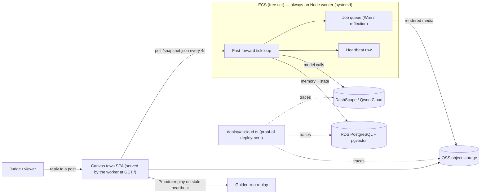

# Architecture

The Feed is a society of generative agents rendered as a watchable, audience-steerable livestream.
This doc covers the runtime components and the live Alibaba Cloud deployment. For the "why" and the
research behind each choice, see [`../strategy/truman-show/`](../strategy/truman-show/).

## Components

| Layer | Module | Responsibility |
|---|---|---|
| Model seam | `src/model/` | `ModelAdapter` interface; deterministic `MockAdapter` (offline) and the real DashScope adapter (`dashscope.ts` — task→model routing across qwen-flash/plus/max + embeddings, wire-verified in tests), chosen by `MODEL_BACKEND`. Nothing else knows which backend is live. |
| Memory | `src/memory/` | `MemoryNode` (ConceptNode-faithful), the `I(m)` retrieval math, and the store (in-memory now; pgvector-shaped API for later). |
| Cognition | `src/agent/` | perceive → store → retrieve → act; reflection tree (poignancy-threshold trigger, evidence-cited insights); recursive daily planning; dialogue; audience-reply ingestion. |
| Social | `src/social/` | moderation gate, the social feed, first-person post composition. |
| World | `src/world/` | event-driven tick loop; conversation orchestrator (stores each utterance in both streams → diffusion); fast-forward buffer + NDJSON persistence. |
| View | `src/view/` | world snapshot (frontend contract, incl. recent dialogue lines), the self-contained canvas town SPA (walkable street-grid town, speech-bubble dialogue playback, news chyron, sim-clock day/night cycle), a no-JS HTML renderer, the importance-driven highlight editor. |
| Eval | `src/eval/` | the controlled ablation scenario + metrics (diffusion, density, divergence). |

## The Salience Engine — one score, three uses

`I(m) = 0.5·recency + 3·relevance + 2·importance` (each component min-max normalized), matching the
released Generative Agents weighting. The stored per-memory `importance` (poignancy, 1–10) is reused:

1. **Retrieval** — ranks what an agent pulls into its next decision.
2. **Highlight editing** — the day's top-importance memories *are* the recap; no separate editor model.
3. **Render-budget gating** — only the single highest-salience beat earns an expensive Wan render.

Audience replies enter this same economy with a +2 bias and are force-surfaced to the next decision, so
a human message provably changes the trajectory (measured as *audience-causal divergence*).

## Cost model in one line

Do not run real-time. Generate the world in **fast-forward** into a buffer that stays ahead of a 1×
playhead; spectators watch "as if live." All generation is therefore offline → **Batch API (50% off)**
applies to every call, and the demo can't go dark (the playhead just waits; a persisted tick log replays
as a golden run). ~15 agents ≈ **$15–34** across the 3-week judging window.

## Deployment (Alibaba Cloud)

**Judge-safety:** the spectator view is pure DB/OSS reads (unlimited viewers ≈ free); Wan/CosyVoice are
disabled from any user-triggered path (pre-rendered only); judge replies route to `qwen-flash` under
per-IP rate limits and a global daily budget cap with a read-only kill-switch; a stale heartbeat
auto-engages the golden-run replay so the URL is never dark through the Aug-11 judging window.

**Proof of Alibaba Cloud deployment:** `deploy/alicloud.ts` initializes the DashScope client against
`dashscope-intl.aliyuncs.com`, the `ali-oss` client, and the pgvector connection — a judge can trace one
request from Qwen model → OSS write → DB row, entirely on Alibaba Cloud.

## Status

Engine verified offline (11 sims, 91 tests) and **deployed live at http://47.237.78.57** — ECS, systemd
unit `thefeed`, real Qwen via `MODEL_BACKEND=dashscope`. The current deployment keeps world state
in-process with an NDJSON tick log (golden-run replay); the RDS/pgvector + OSS pieces in the diagram are
the scale-out path for larger casts and rendered media.
